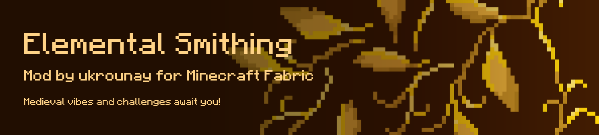

## Elemental Smithing for Fabric 1.20.1

Elemental Smithing is a medieval fantasy-style mod that introduces new materials, tools, armor sets, blocks, status effects, a new villager profession, and a unique structure.  

Created for Fabric 1.20.1 with a 0.15.11+ loader. Supports REI 12.1.725 or higher.  

The mod supports English and Ukrainian languages.

Thanks to Kaupenjoe for [fabric modmaking tutorial](https://github.com/Tutorials-By-Kaupenjoe/Fabric-Tutorial-1.20.X).
> Created with [Fabric template](https://fabricmc.net/develop/template/).
> For textures used [Pixel GPT](https://deep-pixels.com/) , [BlockBench](https://www.blockbench.net/) and [PixelArt Recolor](https://virtualzer0.github.io/PixelArtRecolor/) app.
